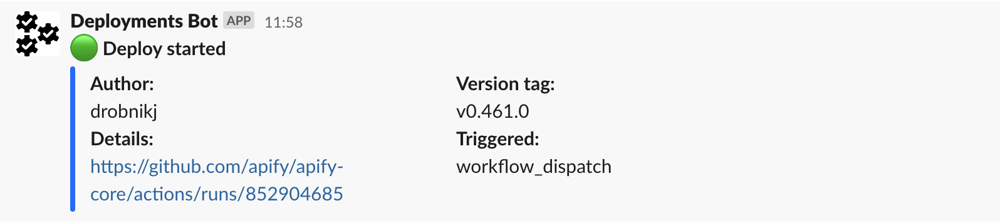

# Apify Slack Messenger

Wraps up messages sending from Apify GitHub workflows into Slack.

# Action input

| Name                                      |                                                                    Description    |                                                     Example | Required |
| ---------------------------------------   | --------------------------------------------------------------------------------  | ----------------------------------------------------------- | -------- |
| `slack-bot-user-oauth-access-token`       |                                                                Slack access token |                                               `slack-token` |      yes |
| `slack-channel`                           |       Slack channel, you can override it using SLACK_CHANNEL environment variable |                                               `C01LBLK4FHA` |      yes |
| `message`                                 | Content of message                                                                |                                           `*Deploy started*`|  yes [1] |
| `color`                                   | Color of message                                                                  |                                                   `#0066ff` |       no |
| `message-type`                            | Message type from prepared messages                                               |                                                `pre-deploy` |  yes [1] |
| `version-tag`                             | Version tag                                                                       |                                                    `v1.0.0` |       no |
[1] If you need to specify message or message-type.

## Usage

For message:


```yaml
name: pre deploy message

on:
    workflow_dispatch:

jobs:    
    pre-deploy-message:
      runs-on: ubuntu-20.04
        needs:
          - tag
        steps:
          - name: clone slack-messages-action
            uses: actions/checkout@v2
            with:
              repository: apify/slack-messages-action
              ref: refs/tags/v1.0.2
              path: ./.github/actions/slack-messenger
    
          - name: pre deploy message
            uses: ./.github/actions/slack-messenger
            with:
              slack-bot-user-oauth-access-token: ${{ secrets.SLACK_BOT_USER_OAUTH_ACCESS_TOKEN }}
              message: ":large_green_circle: *Deploy started*"
              color: "#0066ff"
              slack-channel: C01LBJK4FHA
              version-tag: v0.416.0
```

Or you can use prepared message, you can find list of prepared messages in `/src/messages.ts`.
```yaml
name: pre deploy message

on:
    workflow_dispatch:

jobs:    
    pre-deploy-message:
      runs-on: ubuntu-20.04
        needs:
          - tag
        steps:
          - name: clone slack-messages-action
            uses: actions/checkout@v2
            with:
              repository: apify/slack-messages-action
              ref: refs/tags/v1.0.2
              path: ./.github/actions/slack-messenger
    
          - name: pre deploy message
            uses: ./.github/actions/slack-messenger
            with:
              slack-bot-user-oauth-access-token: ${{ secrets.SLACK_BOT_USER_OAUTH_ACCESS_TOKEN }}
              message-type: pre-deploy
              slack-channel: C01LBJK4FHA
              version-tag: v0.416.0
```

# TBD

- Tests
- GitHub action for publishing new version

## Contribution

1. Update code in `./src`
2. Run `npm i`
3. Run `npm run all`
4. Commit all changes including `./disc` folder with built code.
5. Publish a new version of action using new release (It needs to be done manually)

